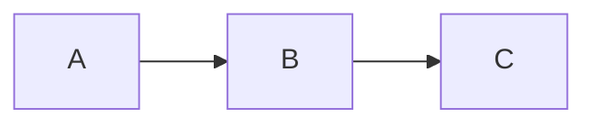
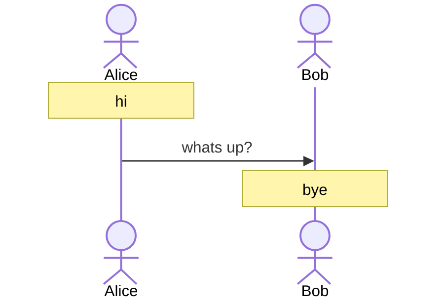

<!-- toc -->
<!-- remove the comment above to disable table-of-contents (toc) -->

# mdBook Template

Start by editing pages here.

## Math

You can do some fancy $\LaTeX$ math:

$$
\sum_{n=1}^{\infty}\frac{1}{n^2} = \frac{1}{1^2} + \frac{1}{2^2} + \frac{1}{3^2} + \ldots = \frac{\pi^2}{6}
$$

## Mermaid

You can draw Mermaid diagrams:

My favorite is a sequence diagram:

